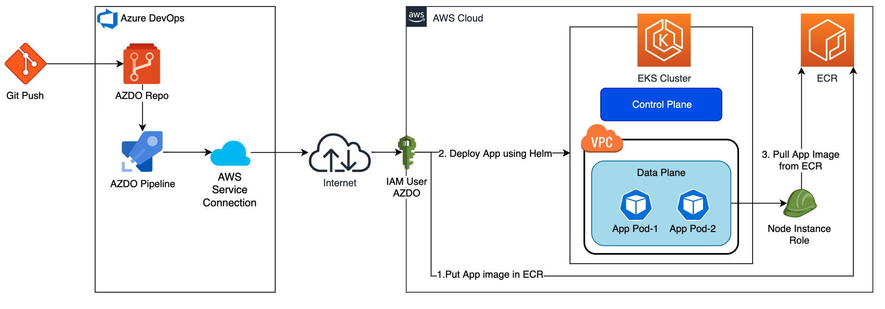

# Deploy Kubernetes resources to Amazon EKS using Azure DevOps
This pattern aims to provide guidance on how to deploy a containerized application to Amazon EKS cluster from Azure DevOps using Helm chart. 
The pattern can be further extended by modifying the pipeline template shared here to use the Azure pipelines service connection for AWS in order to query and use data from AWS Cloud.

## Prerequisites
- AWS Account
- Amazon EKS Cluster with node instance role to pull content from ECR
- IAM user account with access to Amazon EKS Cluster
- Azure DevOps account
- AWS Toolkit for Azure DevOps installed in Azure DevOps or on an on-premises Azure DevOps server
- Application to be deployed (A sample web app provided in this guide)

## Get Started

## Target Architecture

## About the pipeline template
The pipline template composes of 3 templates:

1. Main Template - [main_template.yaml](./pipeline_templates/main_template.yaml)

    This template acts as a central template referring other job templates. It also has a stage for initializing variables and checking existence of AWS resources (Amazon EKS Cluster and ECR repository) at the beginning of the pipeline execution.

    >This is the only template which you may refer when consuming the pipeline template in this solution.

2. CI Job Template - [ci_template.yaml](./pipeline_templates/job_templates/ci_template.yaml)

    This is a job template used by the `main_template.yaml` for:
    - Building Docker Image
    - Pushing Docker Image
    - Building Helm Chart
    - Pushing Helm

3. CD Job Template - [cd_template.yaml](./pipeline_templates/job_templates/cd_template.yaml)

    This is another job template used by `main_template.yaml`. It is dependent on successful execution of `CI` stage and `Init` stage in `main_template.yaml`. 
    
    It is used for:
    - Deploying the Helm Chart
    - Showing deployment output

These templates are organized in directory structure as below:
```
pipeline_templates/
├─ jobs_templates/
│  ├─ ci_template.yaml
│  ├─ cd_template.yaml
├─ main_template.yaml
```

## How to setup the pipeline template
To use the pipeline template, follow this procedure:
1. **Copy the following contents from this repo to your own Azure DevOps repo**
    * Copy the pipeline templates folder as-is
        - [pipeline_templates](./pipeline_templates/) folder (including contents in sub-folders)
    * Copy the sample pipeline that refers the pipeline template
        - [azure_pipeline.yaml](./azure_pipeline.yaml) file
    
    Here is an example to show the usage - [azure_pipeline.yaml](./azure_pipeline.yaml)
2. **Setup a New pipeline in your Azure DevOps**
    * Go to Pipelines, and then select New pipeline.
    * Do the steps of the wizard by first selecting Azure repos git (YAML) as the location of your source code.
    * When you see the list of repositories, select your repository.
    * Select Existing Azure pipelines YAML file in the configure your pipeline section
    * Select the branch as master or main and the path as: /azure_pipeline.yaml. Click on the continue button
    * Replace the input parameter values for the mandatory fields in azure_pipeline.yaml to your needs:
        ```
        serviceConnectionName: Azure DevOps Service Connection name.
        awsRegion: Default region for AWS.
        awsEKSClusterName: Name of the Amazon EKS Cluster used for deployment.
        projectName: Name of the project. This should be same as the Helm chart name
        ```
    * Click on the dropdown menu beside the Run button and save the pipeline
3. **Run the pipeline**
    * Go to Pipelines, and then select the pipeline you just created
    * Click on the Run pipeline button
    * Click on the Run button

## Pipeline template parameters
### Input parameters

| Name                       | Description                                                     | Default Value         |
| -------------------------  | ----------------------------------------------------------------| --------------------- |
| `serviceConnectionName`    | Azure DevOps Service Connection Name                            |                       |
| `awsRegion`                | Default region for AWS                                          |                       |
| `awsEKSClusterName`        | Name of the Amazon EKS Cluster                                  |                       |
| `awsEKSRegion`             | Region for EKS Cluster                                          | `${{ parameters.awsRegion }}` |
| `awsECRRegion`             | Region for ECR repository                                       | `${{ parameters.awsRegion }}` |
| `awsECRAccountId`          | Account ID where ECR Repository is created                      | `AccountID of Service Connection` |
| `projectName`              | Name of the project. Used in naming of K8s resources & Helm Chart  | `"webapp"` |
| `K8sNamespace`             | K8s Namespace for deployment                                    | `${{ parameters.projectName }}` |
| `helmVersion`              | Version of Helm                                                 | `"3.8.2"` |
| `imageName`                | Name of the container image                                     | `${{ parameters.projectName }}` |
| `imageTag`                 | Image Tag for the container image to be generated               | `$(Build.BuildNumber)-image` |
| `helmChartVersion`         | Version number for the helm chart to be created                 | `$(Build.BuildNumber)-helm`  |
| `helmChartDirPath`         | Path of the directory containing the chart to be packaged, eg webapp/charts/webapp | `./${{ parameters.projectName }}/charts/${{ parameters.projectName }}` |
| `dockerfilePath`           | Path of the Dockerfile, eg webapp/Dockerfile.                   | `./${{ parameters.projectName }}/Dockerfile` |

## Limitations
- Amazon EKS cluster is publicly available and may not suit all architectures.
    - For Private EKS cluster, please refer to Azure DevOps Self-Hosted Agents: Self-hosted Linux agents
- To use AWS Toolkit for Azure DevOps for accessing AWS services, you need an AWS account and AWS credentials.
- [Sample web app](./webapp/charts/README.md) provided as a part of this pattern is **only for example purpose**. It is a web server (httpd), hosting a HTML file (index.html). The application is exposed via public load balancer with a Kubernetes service of type `Loadbalancer` over **HTTP**.

## Security

See [CONTRIBUTING](CONTRIBUTING.md#security-issue-notifications) for more information.

## License

This library is licensed under the MIT-0 License. See the [LICENSE](./LICENSE) file.
